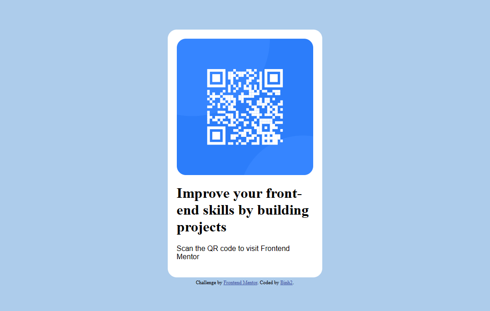

# Frontend Mentor - QR code component solution

This is a solution to the [QR code component challenge on Frontend Mentor](https://www.frontendmentor.io/challenges/qr-code-component-iux_sIO_H). Frontend Mentor challenges help you improve your coding skills by building realistic projects. 

## Overview

### Screenshot



### Links

- Solution URL: [Checkout my solution](https://github.com/Binh2/qr-code-component)
- Live Site URL: [My live webpage](https://binh2.github.io/qr-code-component/)

## My process

Although this is a small project but it is still very crucial to get down the workflow correctly

1. I started sketch the QR code component on figma (Even though I already know what the end result to look like, it is still a very important step to accomplish).
2. Next up, I add my text and images, CSS, *trying to center elements*, and so on,... 

### Built with

- Semantic HTML5 markup
- CSS custom properties

### What I learned

```css
img {
	display: block;
	margin: 0 auto;
}
```

```css
.container {
	position: absolute;
	top: 50%;
	left: 50%;
	transform: translateX(-50%) translateY(-50%);
}
```

## Author

- Frontend Mentor - [@Binh2](https://www.frontendmentor.io/profile/Binh2)
- Twitter - [@hgqbinh2002](https://twitter.com/hgqbinh2002)
- LinkedIn - [hgqbinh2002](https://www.linkedin.com/in/hgqbinh2002/)

## Acknowledgments

Big thank to Frontend Mentor to give me the idea to do this project.




